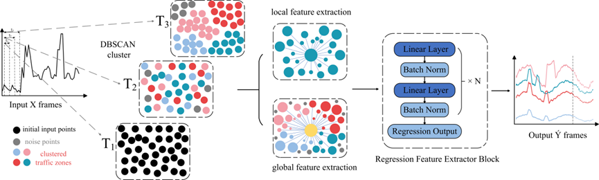

# CALM：Cluster-Aware Linear Model for Dynamic Traffic Flow Prediction


## DGTNet
<p align='center'>
  
</p>

## Directory Structure
```bash
├── dataloader.py         # Module for data loading and preprocessing
├── train.py              # Module for training the model
├── evaluate.py           # Module for model evaluation
├── main.py               # Main script to call all modules for training and evaluation
├── DATA/                 # Directory for data files (you need to add this)
│   └── PEMS_BAY.csv      # Traffic data file
│   └── METR_LA.csv       # Traffic data file
│   └── ...
├── README.md             # Project documentation
└── requirements.txt      # Python dependencies

### Dataset
The traffic data files for Los Angeles (METR-LA) and the Bay Area (PEMS-BAY), i.e., `metr-la.h5` and `pems-bay.h5`, are available at [Google Drive](https://drive.google.com/open?id=10FOTa6HXPqX8Pf5WRoRwcFnW9BrNZEIX) or [Baidu Yun](https://pan.baidu.com/s/14Yy9isAIZYdU__OYEQGa_g), and should be
put into the `data/` folder.


## Requirements
- Python 3.8
- PyTorch = 1.8.0 (with corresponding CUDA version)
- Pandas = 1.4.0
- Numpy = 1.22.2
- PyEMD = 1.2.1

Dependency can be installed using the following command:
```bash
pip install -r requirements.txt
```


## Contact
If you have any questions, please feel free to contact Chen jing (Email: 13891739600@163.com).